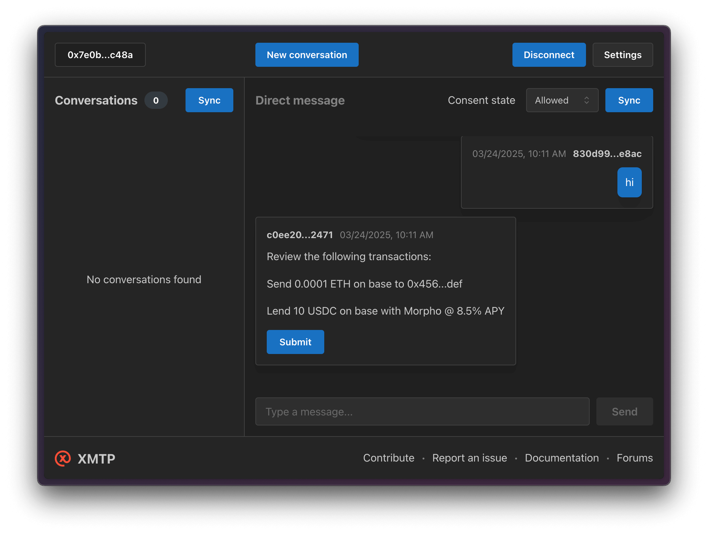

# Transaction agent example

This example uses [content-type-transaction-reference](https://github.com/xmtp/xmtp-js/tree/main/content-types/content-type-transaction-reference) and [content-type-wallet-send-calls](https://github.com/xmtp/xmtp-js/tree/main/content-types/content-type-wallet-send-calls).

> Testing on https://xmtp.heyelsa.ai/conversations/0edf5b5bf1f5057b41a172cc55f479d3



### Environment variables

To run your XMTP agent, you must create a `.env` file with the following variables:

```bash
WALLET_KEY= # the private key of the wallet
ENCRYPTION_KEY= # encryption key for the local database
XMTP_ENV= # local, dev, production
```

You can generate random xmtp keys with the following command:

```tsx
yarn gen:keys <name>
```

> [!WARNING]
> Running the `gen:keys` or `gen:keys <name>` command will append keys to your existing `.env` file.

## Usage

### Create a transaction request

With XMTP, a transaction request is represented using wallet_sendCalls RPC specification from EIP-5792 with additional metadata for display:

```tsx
const walletSendCalls: WalletSendCallsParams = {
  version: "1.0",
  from: address as `0x${string}`,
  chainId: "0x2105",
  calls: [
    {
      to: "0x789...cba",
      data: "0xdead...beef",
      metadata: {
        description: "Transfer .1 USDC on Base Sepolia",
        transactionType: "transfer",
        currency: "USDC",
        amount: 10000000,
        decimals: 6,
        platform: "base-sepolia",
      },
    },
  ],
};
```

### Send a transaction request

Once you have a transaction reference, you can send it as part of your conversation:

```tsx
await conversation.messages.send(walletSendCalls, ContentTypeWalletSendCalls);
```

## Run the agent

```bash
# git clone repo
git clone https://github.com/ephemeraHQ/xmtp-agent-examples.git
# go to the folder
cd xmtp-agent-examples
# install packages
yarn
# go to the folder
cd examples/transaction
# generate random xmtp keys (optional)
yarn gen:keys
# run the example
yarn dev
```
