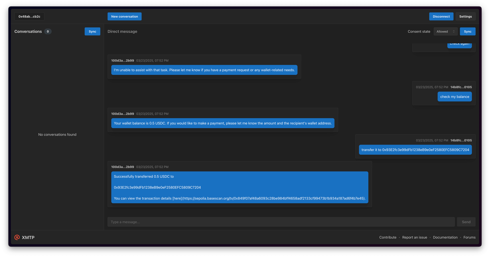

# CDP agentKit langchain example

This example demonstrates an agent setup on XMTP Network with access to the full set of CDP AgentKit actions.



## Getting started

> [!TIP]
> See XMTP's [cursor rules](/.cursor/README.md) for vibe coding agents and best practices.

### Requirements

- Node.js v22 or higher
- Yarn v4 or higher
- Docker (optional, for local network)
- [OpenAI](https://platform.openai.com/api-keys) API key
- [Coinbase Developer Platform](https://portal.cdp.coinbase.com) (CDP) API credentials
- Faucets: [Circle](https://faucet.circle.com), [Base](https://portal.cdp.coinbase.com/products/faucet)

### Environment variables

To run your XMTP agent, you must create a `.env` file with the following variables:

```bash
# XMTP Configuration
XMTP_WALLET_KEY= # the private key for the wallet
XMTP_DB_ENCRYPTION_KEY= # the encryption key for the wallet
XMTP_ENV=dev # local, dev, or production

# OpenAI Configuration
OPENAI_API_KEY= # the OpenAI API key

# CDP v2 Configuration (required)
CDP_API_KEY_ID= # your CDP API key ID
CDP_API_KEY_SECRET= # your CDP API key secret
CDP_WALLET_SECRET= # your CDP wallet secret

# Optional CDP Configuration
IDEMPOTENCY_KEY= # optional idempotency key for wallet operations
NETWORK_ID=base-sepolia # base-sepolia or base-mainnet
RPC_URL= # optional custom RPC URL
```

### Run the agent

```bash
# git clone repo
git clone https://github.com/ephemeraHQ/xmtp-agent-examples.git
# go to the folder
cd xmtp-agent-examples
cd examples/xmtp-coinbase-agentkit
# install packages
yarn
# generate random xmtp keys (optional)
yarn gen:keys
# run the example
yarn dev
```

## Usage

Example prompts:

- "Transfer a portion of your ETH to a random address"
- "What is the price of BTC?"
- "Request eth and usdc from faucet" (base-sepolia only)
- "Swap 1 USDC to ETH" (base-mainnet only)

## License

Apache-2.0
