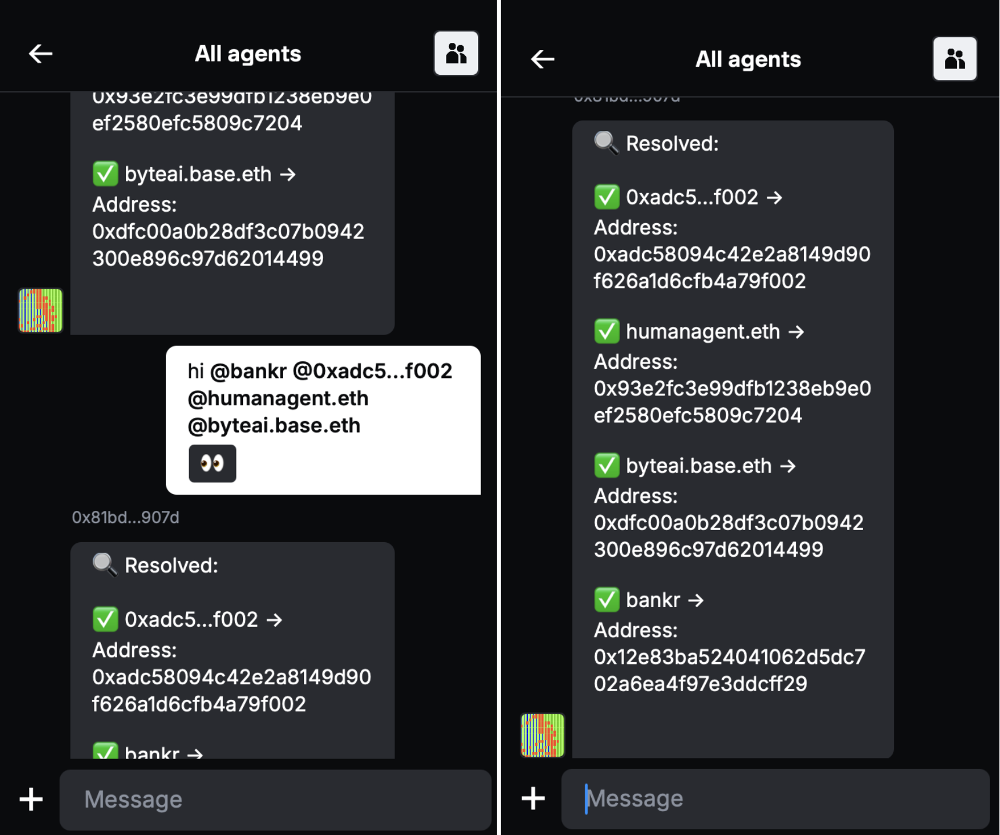

# ENS resolver example

An XMTP agent that performs reverse resolution of Ethereum addresses to Web3 identities using the [Web3.bio API](https://api.web3.bio/).



## Usage

## Usage

Send an Ethereum address and the agent will look up associated domain names across various Web3 platforms:

```tsx
on("text", async (ctx) => {
  const input = ctx.getSenderAddress();
  const results = await fetchFromWeb3Bio(input);
  const names = results.map((result) => result.identity).join("\n");
  await ctx.sendText(names);
});
```

- **ENS** (e.g., `vitalik.eth`)
- **Farcaster** (e.g., `dwr.eth`)
- **Lens Protocol** (e.g., `stani.lens`)
- **Basenames** (e.g., `tony.base.eth`)
- **Linea Name Service** (e.g., `name.linea.eth`)

Simply message the agent with:

- An ENS name: `vitalik.eth`
- An Ethereum address: `0xd8dA6BF26964aF9D7eEd9e03E53415D37aA96045`

## Getting started

> [!TIP]
> See XMTP's [cursor rules](/.cursor/README.md) for vibe coding agents and best practices.

### Requirements

- Node.js v20 or higher
- Yarn v4 or higher
- Docker (optional, for local network)

### Environment variables

To run your XMTP agent, you must create a `.env` file with the following variables:

```bash
XMTP_WALLET_KEY= # the private key of the wallet
XMTP_DB_ENCRYPTION_KEY= # encryption key for the local database
XMTP_ENV=dev # local, dev, production
```

### Run the agent

```bash
# git clone repo
git clone https://github.com/ephemeraHQ/xmtp-agent-examples.git
# go to the folder
cd xmtp-agent-examples
cd examples/xmtp-domain-resolver
# install packages
yarn
# generate random xmtp keys (optional)
yarn gen:keys
# run the example
yarn dev
```
