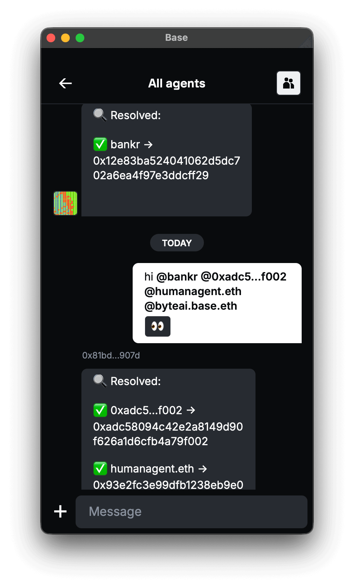
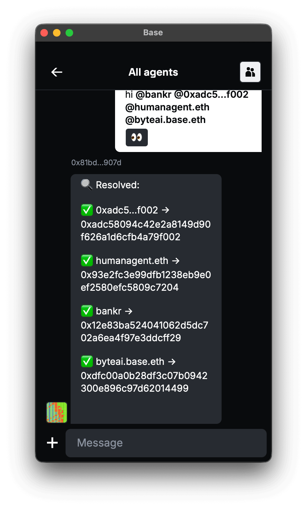

# Domain resolver example

An XMTP agent that resolves Ethereum addresses to Web3 identities using the [Web3.bio API](https://api.web3.bio/).

<p align="center" >
  
  
</p>

## Usage

Send mentions with Ethereum addresses or domain names, and the agent will resolve them:

```tsx
// Resolve all mentions to Ethereum addresses
const resolved = await resolveMentionsInMessage(
  ctx.message.content,
  await ctx.conversation.members(),
);
// Returns: { "bankr.farcaster.eth": "0x...", "0xabc5…f002": "0x..." }

// Resolve ENS names or other web3 identities using web3.bio
const resolveAddress = createNameResolver("your-web3bio-api-key");
const address = await resolveAddress("bankr");
console.log(`Resolved address: ${address}`);

//farcaster profile
const senderProfile = await fetchFarcasterProfile(senderAddress);
if (senderProfile.username) {
  console.log(
    `Message from Farcaster user: ${senderProfile.username}, FID: ${senderProfile.social?.uid}`,
  );
}
```

### Supported platforms

- **ENS** (e.g., `vitalik.eth`)
- **Farcaster** (e.g., `dwr.eth`)
- **Basenames** (e.g., `tony.base.eth`)
- **Lens Protocol** (e.g., `stani.lens`)

## Getting started

### Requirements

- Node.js v20 or higher
- Yarn v4 or higher
- Docker (optional, for local network)
- Web3.social [api key](https://api.web3.bio/) (default API)
- neynar [api key](https://docs.neynar.com/reference/fetch-bulk-users) (alternative to web3.social)

### Environment variables

To run your XMTP agent, you must create a `.env` file with the following variables:

```bash
XMTP_WALLET_KEY= # the private key of the wallet
XMTP_DB_ENCRYPTION_KEY= # encryption key for the local database
XMTP_ENV=dev # local, dev, production
```

### Run the agent

```bash
# git clone repo
git clone https://github.com/ephemeraHQ/xmtp-agent-examples.git
# go to the folder
cd xmtp-agent-examples
cd examples/xmtp-domain-resolver
# install packages
yarn
# generate random xmtp keys (optional)
yarn gen:keys
# run the example
yarn dev
```
