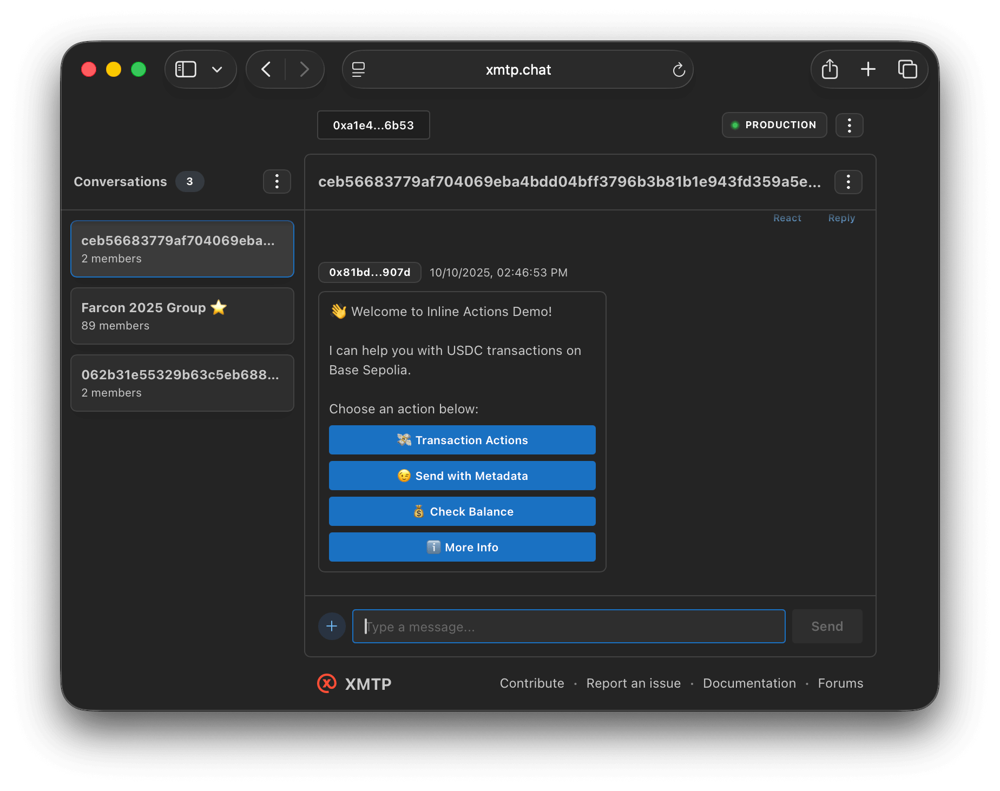

# XMTP Inline Actions Agent

A focused XMTP agent demonstrating inline actions UX/UI with interactive buttons and USDC transactions.

<p align="center" >
  
  
</p>

## Usage

Send `/help` to see the main menu. This example showcases core inline action UX patterns:



### **1. Using Inline Actions Utils**

```typescript
import {
  inlineActionsMiddleware,
  registerAction,
  ActionBuilder,
  sendActions,
} from "../../utils/inline-actions/inline-actions";

// Register action handlers
registerAction("send-small", async (ctx) => {
  // Handle the action
});

// Use the middleware
agent.use(inlineActionsMiddleware);
```

### **2. USDC Handler Integration**

```typescript
import { USDCHandler } from "../../utils/usdc";

const usdcHandler = new USDCHandler(NETWORK_ID);
const balance = await usdcHandler.getUSDCBalance(address);
```

### **3. Action Builder Patterns**

```typescript
// Basic actions
ActionBuilder.create("id", "description")
  .add("action-id", "Button Label")
  .build();

// Actions with images
ActionBuilder.create("id", "description")
  .add("action-id", "Button Label", "https://cataas.com/cat")
  .build();
```

## Getting started

### Requirements

- Node.js v20 or higher
- Yarn v4 or higher
- Docker (optional, for local network)
- [OpenAI](https://platform.openai.com/api-keys) API key

### Environment variables

To run your XMTP agent, you must create a `.env` file with the following variables:

```bash
XMTP_WALLET_KEY= # the private key of the wallet
XMTP_DB_ENCRYPTION_KEY= # encryption key for the local database
XMTP_ENV=dev # local, dev, production
```

### Run the agent

```bash
# git clone repo
git clone https://github.com/ephemeraHQ/xmtp-agent-examples.git
# go to the folder
cd xmtp-agent-examples
cd examples/xmtp-inline-actions
# install packages
yarn
# generate random xmtp keys (optional)
yarn gen:keys
# run the example
yarn dev
```
