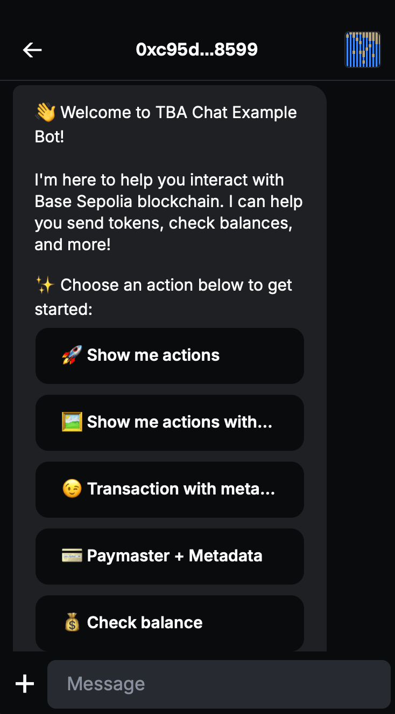
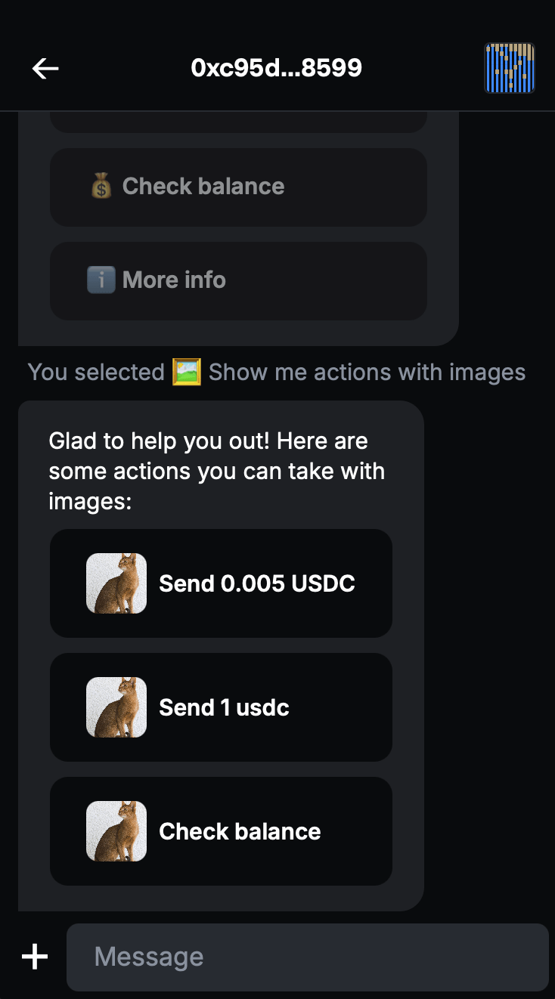

# XMTP Inline Actions Agent

A focused XMTP agent demonstrating inline actions UX/UI with interactive buttons and USDC transactions.

<p align="center">
  
  
</p>

## Features

- **Inline Actions**: Interactive buttons with different styles and images
- **Token Transfers**: Send USDC using wallet send calls (EIP-5792)
- **Balance Checking**: Check USDC balances on-chain
- **Network Support**: Base Sepolia and Base Mainnet

## Quick Start

1. **Set up environment variables** in `.env`:

```bash
# Network: base-sepolia or base-mainnet
NETWORK_ID=base-sepolia

# XMTP Configuration
XMTP_ENV=dev
XMTP_WALLET_KEY=your_private_key_here
XMTP_DB_ENCRYPTION_KEY=your_encryption_key_here
```

2. **Install and run**:

```bash
yarn install
yarn gen:keys  # if you don't have keys
yarn dev
```

## Usage

Send `/help` or `gm` to see the main menu:

### **Main Menu Actions**

- **💸 Transaction Actions**: Opens transaction menu with send options
- **💰 Check Balance** (with cat image): View bot's USDC balance
- **ℹ️ More Info**: Network and feature information

### **Transaction Actions Menu**

- **Send 0.005 USDC**: Small transfer
- **Send 1 USDC**: Larger transfer
- **Check Balance**: View balance

## How It Works

This example showcases core inline action UX patterns:

### **1. Using Inline Actions Utils**

```typescript
import {
  inlineActionsMiddleware,
  registerAction,
  ActionBuilder,
  sendActions,
} from "../../utils/inline-actions/inline-actions";

// Register action handlers
registerAction("send-small", async (ctx) => {
  // Handle the action
});

// Use the middleware
agent.use(inlineActionsMiddleware);
```

### **2. USDC Handler Integration**

```typescript
import { USDCHandler } from "../../utils/usdc";

const usdcHandler = new USDCHandler(NETWORK_ID);
const balance = await usdcHandler.getUSDCBalance(address);
```

### **3. Action Builder Patterns**

```typescript
// Basic actions
ActionBuilder.create("id", "description")
  .add("action-id", "Button Label", "primary")
  .build();

// Actions with images
ActionBuilder.create("id", "description")
  .add("action-id", "Button Label", "primary", "https://cataas.com/cat")
  .build();
```

### **4. UX Features Demonstrated**

- **Button Styles**: `primary`, `secondary` button styles
- **Action Images**: One button with image to show the capability
- **Menu Navigation**: Main menu → sub-menu pattern
- **Clean UX**: Focused on essential inline action patterns

## Test

Visit [https://xmtp.chat](https://xmtp.chat) and start a conversation with your agent!
