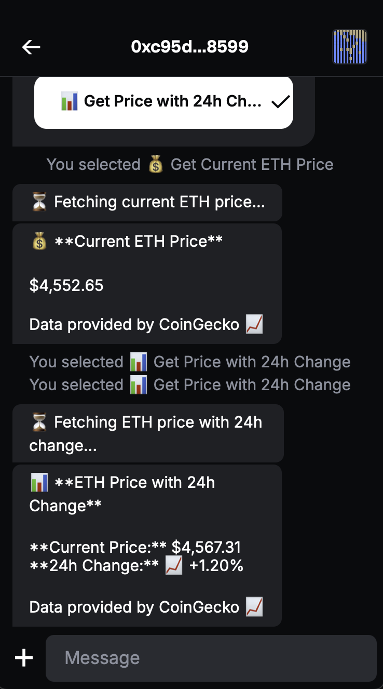
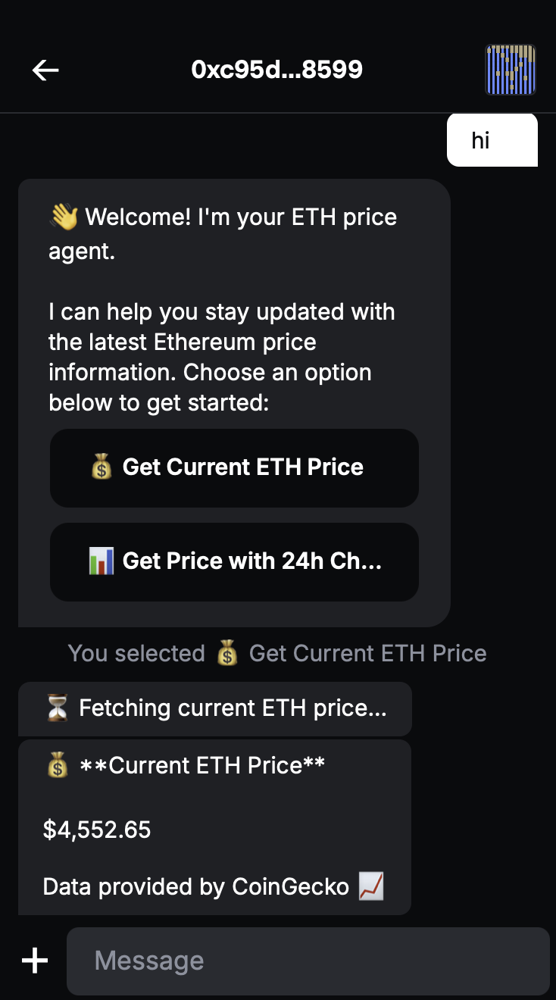

# XMTP welcome message example

When someone first messages the agent, they receive an interactive welcome message with two buttons.

<p align="center">
  
  
</p>

## Usage

This UX is meant to help onboard the users to the agent on the right and first step to engage with the agent.

**Message Text:**

> 👋 Welcome! I'm your ETH price agent.
>
> I can help you stay updated with the latest Ethereum price information. Choose an option below to get started:

**Interactive Buttons:**

- 💰 **Get Current ETH Price** - Shows current ETH price in USD
- 📊 **Get Price with 24h Change** - Shows price with trend indicators

### Sample Responses

**Current Price:**

> 💰 **Current ETH Price**
>
> $2,456.78
>
> Data provided by CoinGecko 📈

**Price with 24h Change:**

> 📊 **ETH Price with 24h Change**
>
> **Current Price:** $2,456.78
> **24h Change:** 📈 +3.45%
>
> Data provided by CoinGecko 📈

## Available Actions

| Action Button                | Description                          |
| ---------------------------- | ------------------------------------ |
| 💰 Get Current ETH Price     | Fetches current ETH price in USD     |
| 📊 Get Price with 24h Change | Shows price with 24-hour change data |

**Commands:**

- Type `help` or `gm` to show the welcome message again

## Technical Features

The agent demonstrates:

- **Inline Actions**: XIP-67 compliant interactive buttons
- **Content Types**: Custom ActionsContent and IntentContent codecs
- **First-time detection**: Shows welcome message only on first interaction
- **External API**: Fetches real-time data from CoinGecko
- **Error handling**: Graceful fallbacks for API failures

## Implementation Highlights

```typescript
// Inline Actions Content
const welcomeActions: ActionsContent = {
  id: `welcome-${Date.now()}`,
  description: "👋 Welcome! I'm your ETH price agent...",
  actions: [
    {
      id: "get-current-price",
      label: "💰 Get Current ETH Price",
      style: "primary",
    },
    {
      id: "get-price-chart",
      label: "📊 Get Price with 24h Change",
      style: "secondary",
    },
  ],
};

// Register codecs
const client = await Client.create(signer, {
  dbEncryptionKey,
  env: XMTP_ENV as XmtpEnv,
  codecs: [new ActionsCodec(), new IntentCodec()],
});
```

## Getting started

> [!TIP]
> See XMTP's [cursor rules](/.cursor/README.md) for vibe coding agents and best practices.

### Requirements

- Node.js v20 or higher
- Yarn v4 or higher
- Docker (optional, for local network)

### Environment variables

To run your XMTP agent, you must create a `.env` file with the following variables:

```bash
WALLET_KEY= # the private key of the wallet
ENCRYPTION_KEY= # encryption key for the local database
XMTP_ENV=dev # local, dev, production
```

You can generate random xmtp keys with the following command:

```bash
yarn gen:keys
```

> [!WARNING]
> Running the `gen:keys` command will append keys to your existing `.env` file.

### Run the agent

```bash
# git clone repo
git clone https://github.com/ephemeraHQ/xmtp-agent-examples.git
# go to the folder
cd xmtp-agent-examples
cd examples/xmtp-welcome-message
# install packages
yarn
# generate random xmtp keys (optional)
yarn gen:keys
# run the example
yarn dev
```
