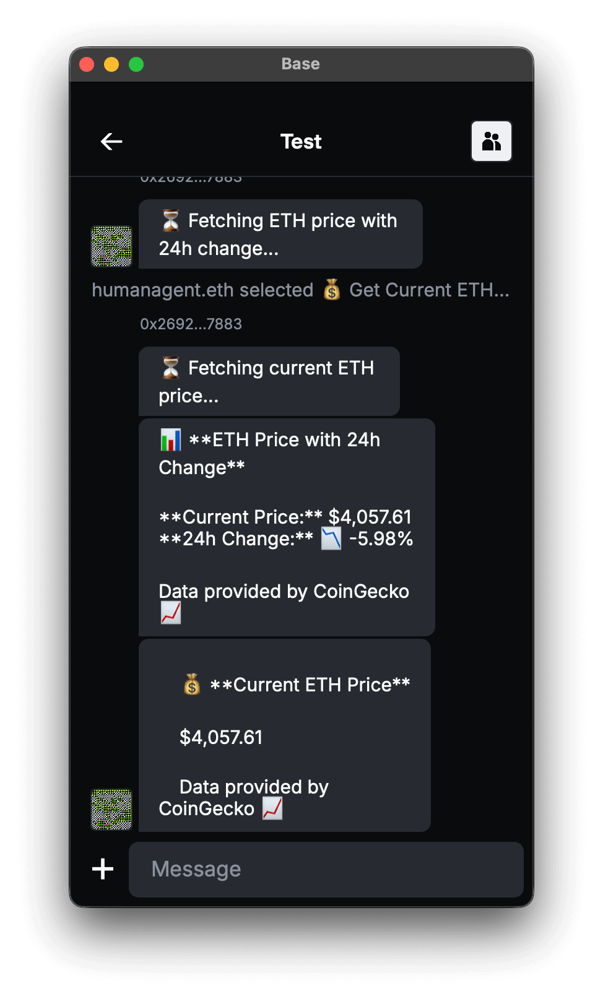

# XMTP Welcome Message Example

An ETH price agent that demonstrates welcome messages with interactive buttons and middleware architecture.

<p align="center">
  
  
</p>

## Features

- **Welcome Message**: Interactive onboarding with action buttons for both DMs and Groups
- **ETH Price Data**: Real-time price fetching from CoinGecko API
- **Native Event Handlers**: Uses `dm` and `group` events for automatic welcome messages
- **Inline Actions**: Interactive buttons for easy user interaction
- **Error Handling**: Graceful API failure handling

## Usage

The agent uses native XMTP event handlers for DMs and Groups:

```typescript
import { Agent, Conversation, ConversationContext } from "@xmtp/agent-sdk";

// Shared welcome message function
async function sendWelcomeMessage(
  ctx: ConversationContext<unknown, Conversation>,
) {
  const welcomeActions = ActionBuilder.create(
    `welcome-${Date.now()}`,
    `👋 Welcome! I'm your ETH price agent...`,
  )
    .add("get-current-price", "💰 Get Current ETH Price")
    .add("get-price-chart", "📊 Get Price with 24h Change")
    .build();

  await sendActions(ctx.conversation, welcomeActions);
}

// Listen for new DM conversations
agent.on("dm", async (ctx) => {
  sendWelcomeMessage(ctx);
});

// Listen for new Group conversations
agent.on("group", async (ctx) => {
  sendWelcomeMessage(ctx);
});
```

## Getting started

> [!TIP]
> See XMTP's [cursor rules](/.cursor/README.md) for vibe coding agents and best practices.

### Requirements

- Node.js v20 or higher
- Yarn v4 or higher
- Docker (optional, for local network)

### Environment variables

To run your XMTP agent, you must create a `.env` file with the following variables:

```bash
XMTP_WALLET_KEY= # the private key of the wallet
XMTP_DB_ENCRYPTION_KEY= # encryption key for the local database
XMTP_ENV=dev # local, dev, production
```

### Run the agent

```bash
# git clone repo
git clone https://github.com/ephemeraHQ/xmtp-agent-examples.git
# go to the folder
cd xmtp-agent-examples
cd examples/xmtp-welcome-message
# install packages
yarn
# generate random xmtp keys (optional)
yarn gen:keys
# run the example
yarn dev
```

## Reference

This example is based on the [TBA Chat Example Bot](https://github.com/siwan-cb/tba-chat-example-bot).
