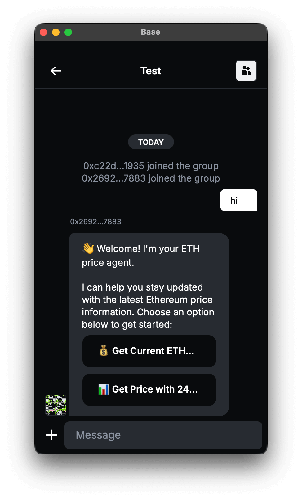

# XMTP Welcome Message Example

An ETH price agent that demonstrates welcome messages with interactive buttons and middleware architecture.

<p align="center">
  
  
</p>

## Features

- **Welcome Message**: Interactive onboarding with action buttons
- **ETH Price Data**: Real-time price fetching from CoinGecko API
- **Middleware Architecture**: Clean separation of concerns with custom middleware
- **First-time Detection**: Identifies first-time interactions
- **Error Handling**: Graceful API failure handling

## Usage

When users message the agent, they receive an interactive welcome message:

**Welcome Message:**

> 👋 Welcome! I'm your ETH price agent.
>
> I can help you stay updated with the latest Ethereum price information. Choose an option below to get started:

**Interactive Actions:**

- 💰 **Get Current ETH Price** - Shows current ETH price in USD
- 📊 **Get Price with 24h Change** - Shows price with trend indicators

### Sample Responses

**Current Price:**

> 💰 **Current ETH Price**
>
> $2,456.78
>
> Data provided by CoinGecko 📈

**Price with 24h Change:**

> 📊 **ETH Price with 24h Change**
>
> **Current Price:** $2,456.78
> **24h Change:** 📈 +3.45%
>
> Data provided by CoinGecko 📈

## Technical Implementation

### Middleware Architecture

The agent uses multiple middleware layers:

```typescript
import {
  inlineActionsMiddleware,
  registerAction,
} from "../../utils/inline-actions/inline-actions";

// Custom middleware for first-time detection
const firstTimeInteractionMiddleware: AgentMiddleware = async (ctx, next) => {
  const messages = await ctx.conversation.messages();
  const hasSentBefore = messages.some(
    (msg) =>
      msg.senderInboxId.toLowerCase() === ctx.client.inboxId.toLowerCase(),
  );
  // Add first-time interaction logic
  await next();
};

// Add middleware to agent
agent.use(firstTimeInteractionMiddleware);
agent.use(inlineActionsMiddleware);
```

### Action Registration

Actions are registered using the inline actions utilities:

```typescript
import {
  ActionBuilder,
  registerAction,
  sendActions,
} from "../../utils/inline-actions/inline-actions";

// Register action handlers
registerAction("get-current-price", handleCurrentPrice);
registerAction("get-price-chart", handlePriceWithChange);

// Send welcome actions
const welcomeActions = ActionBuilder.create(
  `welcome-${Date.now()}`,
  `👋 Welcome! I'm your ETH price agent...`,
)
  .add("get-current-price", "💰 Get Current ETH Price")
  .add("get-price-chart", "📊 Get Price with 24h Change")
  .build();

await sendActions(ctx, welcomeActions);
```

### External API Integration

The agent fetches real-time ETH price data:

```typescript
// Price fetching with error handling
async function handleCurrentPrice(ctx: MessageContext) {
  try {
    await ctx.sendText("⏳ Fetching current ETH price...");
    const { price } = await getCurrentPrice();
    const formattedPrice = formatPrice(price);
    await ctx.sendText(`💰 **Current ETH Price**\n\n${formattedPrice}`);
  } catch (error) {
    await ctx.sendText(`❌ Failed to fetch ETH price: ${error.message}`);
  }
}
```

## Getting started

> [!TIP]
> See XMTP's [cursor rules](/.cursor/README.md) for vibe coding agents and best practices.

### Requirements

- Node.js v20 or higher
- Yarn v4 or higher
- Docker (optional, for local network)

### Environment variables

To run your XMTP agent, you must create a `.env` file with the following variables:

```bash
XMTP_WALLET_KEY= # the private key of the wallet
XMTP_DB_ENCRYPTION_KEY= # encryption key for the local database
XMTP_ENV=dev # local, dev, production
```

You can generate random xmtp keys with the following command:

```bash
yarn gen:keys
```

> [!WARNING]
> Running the `gen:keys` command will append keys to your existing `.env` file.

### Run the agent

```bash
# git clone repo
git clone https://github.com/ephemeraHQ/xmtp-agent-examples.git
# go to the folder
cd xmtp-agent-examples
cd examples/xmtp-welcome-message
# install packages
yarn
# generate random xmtp keys (optional)
yarn gen:keys
# run the example
yarn dev
```

## Reference

This example is based on the [TBA Chat Example Bot](https://github.com/siwan-cb/tba-chat-example-bot).
