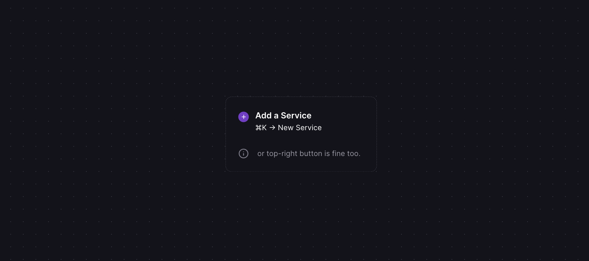
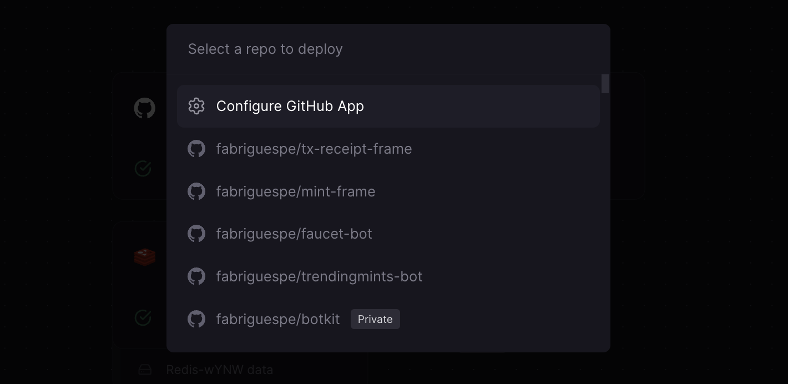
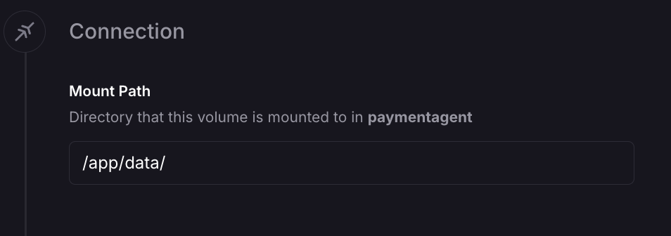
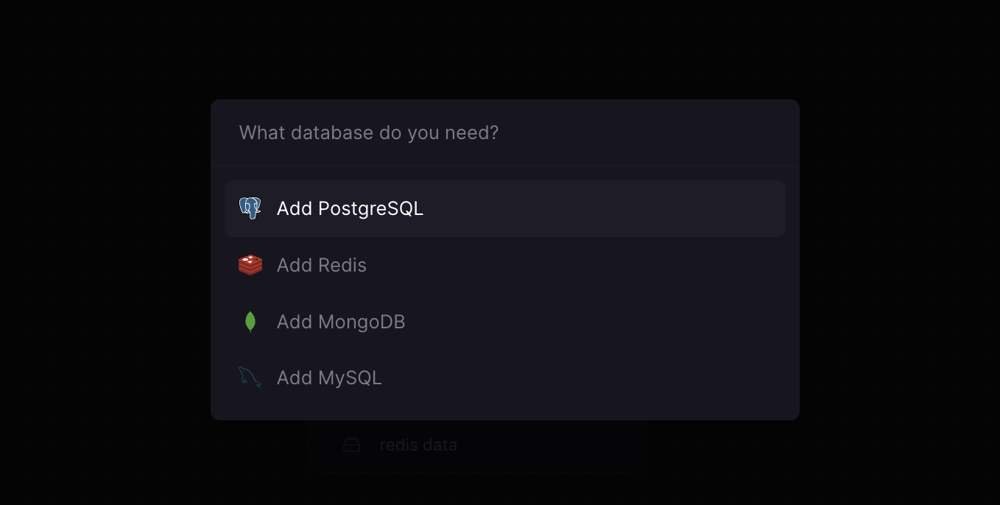
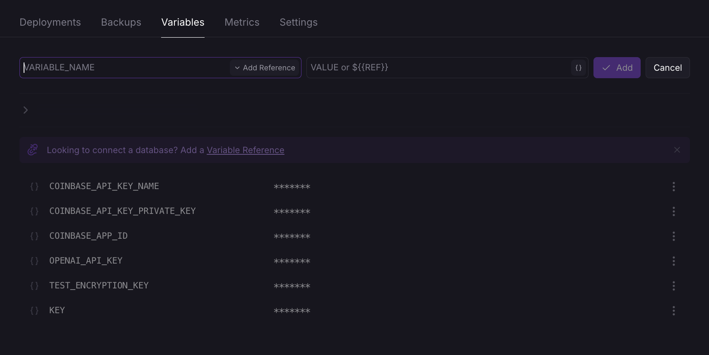

# Deploying to Railway

This guide walks you through deploying your agent application on [Railway](https://railway.app/). You’ll learn how to set up your project, configure volumes for storage, optionally integrate a database, and provide environment variables.

---

## 1. Sign Up and Create a Project

1. **Sign Up**  
   Visit [railway.app](https://railway.app/) and create an account if you don’t already have one.

2. **New Project**  
   After logging in, click **New Project**.
   - You can start with an empty project or pick **Node.js** as a template.



---

## 2. Import a GitHub Repository

1. **Repository Selection**  
   From the project dashboard, choose **Import from GitHub**.
2. **Select Repo**  
   Choose the repository you want to deploy.



Railway will clone the repository and set up an automatic build process.

---

## 3. Add a Volume

1. **Attach Volume**  
   On your project’s dashboard, go to **Settings** or **Variables** (depending on your plan’s UI) and add a **Volume**.
2. **Mount Path**  
   Attach the volume to a folder in your container, for example `/data`.

Then, in your application code, specify the `dbPath` as the environment variable provided by Railway:

```tsx
const client = await createClient({
  dbPath: process.env.RAILWAY_VOLUME_MOUNT_PATH,
  // or a custom path pointing to the mounted volume
});
```



This gives your XMTP client a persistent storage path to save conversation data and keys across deployments.

---

## 4. Optional: Add a Database

Railway supports adding managed databases to your project:

1. **Add DB**  
   Right-click on your project to provision a Redis database or another supported service.



2. **Get Connection String**  
   After the database is created, view its **connection details** or **variables**.


3. **Set Environment Variables**  
   Add the connection string to your project’s **Environment** page, so your application can securely access the database.



---

## 5. Deploy Your Application

After setting up the volume, environment variables, and (optionally) a database:

1. **Trigger Deploy**  
   Railway will often auto-deploy when you push changes to the main branch. You can also redeploy manually through the dashboard.

2. **Check Logs**  
   Use the **Logs** tab to confirm your service starts properly.

3. **Access URL**  
   Railway provides a temporary domain. You can map it to a custom domain or register an [ENS domain](https://ens.domains/) if desired.

---

## 6. (Optional) Share Your App with ENS

For a more user-friendly address:

1. **Register ENS**  
   Go to [ens.domains](https://ens.domains/) and register a name.
2. **Set Custom Records**  
   Point the ENS to your Railway-provided URL or custom domain.

---

## Summary

Railway simplifies the deployment and management of your Node.js agent application. By leveraging volumes for persistent storage and optional database services, you can keep your XMTP client and conversation data consistent across restarts. Setting environment variables through Railway’s dashboard keeps sensitive information secure, and an ENS domain can add a polished final touch.
